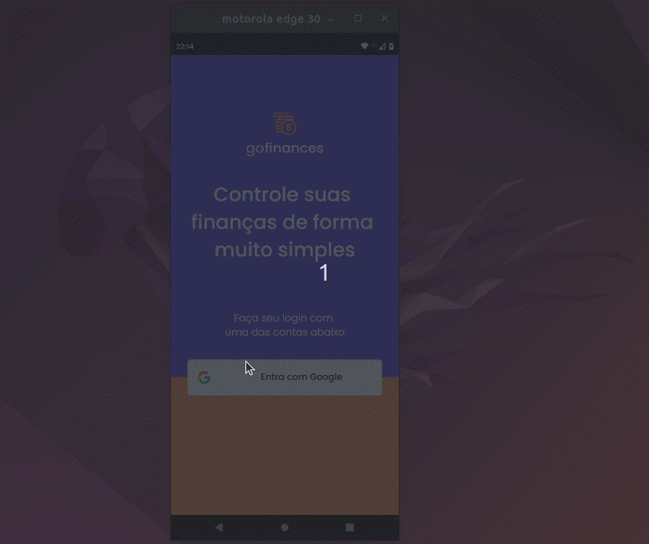
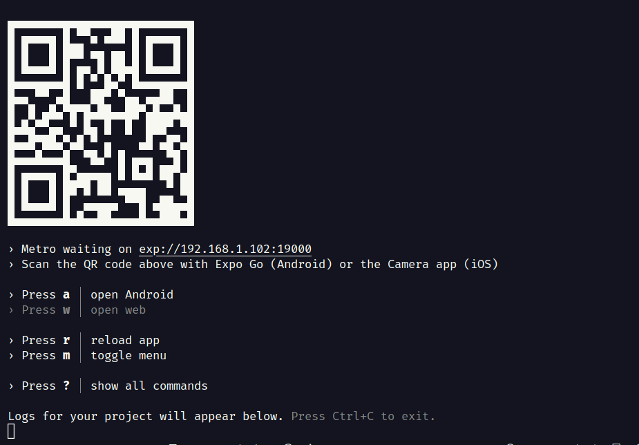

## Daily Diet

&nbsp;

Gofinances é um aplicativo de finanças pessoais, no qual você pode registrar suas transações e monitorá-las, observado as entradas, saídas, saldo e gastos por categoria e data. É um app perfeito para se organizar!

Oferecendo um sistema simples e funcional que facilitará essa organização e te ajudará a manter o controle.

O projeto foi desenvolvido com foco em usabilidade e eficiência, utilizando as mais modernas tecnologias e melhores práticas de programação.

### :rocket: Tecnologias utilizadas:

- React Native é uma biblioteca Javascript criada pelo Facebook.[2] É usada para desenvolver aplicativos para os sistemas Android[3] e iOS de forma nativa.
- Os princípios de funcionamento do React Native são virtualmente idênticos ao ReactJs, exceto que o React Native não manipula o DOM através do Virtual DOM. Ele é executado em um processo em segundo plano (que interpreta o JavaScript escrito pelos desenvolvedores) diretamente no dispositivo final e se comunica com a plataforma nativa por meio de uma serialização, uma ponte assíncrona e em lote.

- É um conjunto de ferramentas e serviços construídos em torno de plataformas nativas e React Native que ajudam você a desenvolver, construir, implantar e iterar rapidamente em aplicativos iOS, Android e web a partir da mesma base de código JavaScript/TypeScript.

<pre>React Navigation</pre>

- O React Navigation é responsável por resolver uma grande questão de suas aplicações: a navegação. Influenciando na experiência da pessoa usuário e no design do app, a navegação e pode tornar tudo mais fácil ou mais complexo.

- Porém o React Native não apresenta uma solução para o roteamento de forma nativa. Então, o React Navigation é uma possibilidade para realizar isso de forma simples e que você vai conhecer em detalhes neste artigo.

- Typescript devido ser uma linguagem que ajuda garantir a qualidade do código, apontando erros no desenvolvimento da aplicação proporcionando maior segurança.

- ESLint para identificar erros e automatizar a padronização do código do projeto.

- O Styled Components é uma biblioteca (lib) do React e do React Native que nos permite criar componentes de estilo ao escrever códigos CSS dentro de um arquivo JavaScript.

- O modo de estilizar um componente utilizando a biblioteca Styled Components também é conhecido como CSS-in-JS (CSS dentro do JavaScript).

<pre>Async Storage</pre>

- AsyncStorage é uma API nativa do React Native, utilizada para armazenar dados persistentes no dispositivo. É uma forma de salvar dados no formato chave e valor.

- Os dados salvos com a API AsyncStorage, são asyncronos, com isso retornam um Promisse, e em caso de erro retorna um Error.

- O date-fns é uma biblioteca para formatar e calcular datas de uma forma menos assustadora para os desenvolvedores considerado uma alternativa valiosa ao Moment.js não apenas porque oferece o mesmo conjunto de recursos, mas também porque é atraente para programadores funcionais. Além disso, o date-fns tem um tamanho de pacote menor em comparação com o Moment.js, o que o torna mais fácil de usar em projetos com limitações de tamanho.

- É um construtor de esquemas para validação de campos e transformação de valores no JavaScript. Simplificando, a partir do Yup temos o conceito de schema,que nada mais é que o formato que os seus campos devem seguir, ou seja, se tivermos um objeto, que dentro temos três campos que devem ser textos, a partir do Yup definimos um schema para isso. Os esquemas (schemas) são muito flexíveis e permitem modelar complexas validações, correlacionadas ou não e até mesmo transformação de valores.

- React Hook Form é uma biblioteca que auxilia na criação e validação dos formulários, como já mencionado, além de reduzir a quantidade de código desenvolvido, fazendo com que a captura de ações do formulário também seja mais objetiva. Outra facilidade que ele traz é na melhora significativa de desempenho, já que a ação de renderização também pode ser controlada. Dessa forma, apenas as alterações de entradas são rerrenderizadas, não o formulário inteiro.

- Google Fonts é uma biblioteca com mais de 800 fontes livres licenciadas, um diretório web interativo para navegar na biblioteca, e APIs para usar convenientemente as fontes através de CSS e Android.

## :hammer: Executar Aplicação

1- Realizar o clone desse projeto.

- `git clone https://github.com/tilo1306/Daily-Diet.git`

2- Depois escrever o comando no terminal:

- `npm install`

3- Ao final da instalação escrever o comando no terminal:

- `expo start`

#### Usando um cabo USB

1- No sistema operacional windows/linux o expo so funciona em celulares android.

2- No sistema operaciona MAC o expo funciona so em celulares ios.

3- Com o cabo conectado ao Computador

4- Para rodar no celular com android no terminal aperta a letra

- `a`

5- Para rodar no celular com ios no terminal aperta a letra

- `i`

##### Usando QRCODE

1- Instalar o aplicativo expo no seu celular.

2- Abrir o aplicativo.

3- Selecionar Scan QR code.

4- Realizar a leitura do QRCode que mostra no terminal exemplo abaixo.

5- Aproveitar o aplicativo :D.

## Contato

  
  
  

